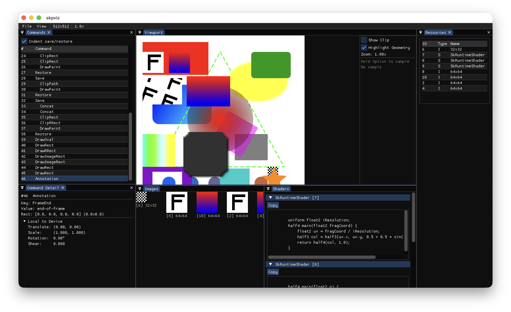
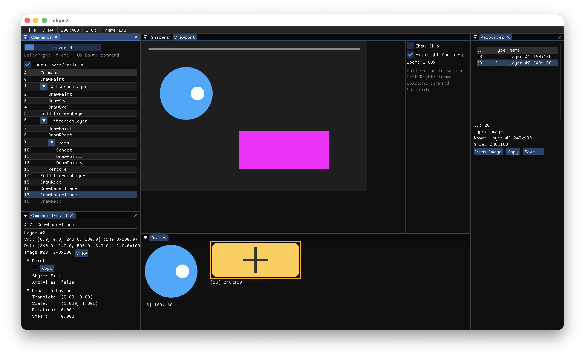

# skpviz

Local SKP file replay and debugging tool.




## Building

Everything builds from source. Dependencies are git submodules.

```sh
git clone --recursive https://github.com/cairnc/skpviz.git
cd skpviz
git config core.hooksPath .githooks  # enable clang-format on commit
```

### macOS

Needs Xcode command line tools, CMake, and Ninja (`brew install cmake ninja`).

```sh
cd third_party/skia
python3 tools/git-sync-deps
bin/gn gen out/Release --args='is_debug=false skia_use_gl=true skia_use_metal=true'
ninja -C out/Release skia
cd ../..

cmake -B build -DCMAKE_BUILD_TYPE=Release -G Ninja
cmake --build build
```

### Linux

```sh
sudo apt-get install -y cmake ninja-build python3 \
    libgl-dev libx11-dev libxrandr-dev libxinerama-dev \
    libxcursor-dev libxi-dev libxext-dev libxss-dev libxtst-dev \
    libwayland-dev libxkbcommon-dev libdecor-0-dev \
    libdbus-1-dev libibus-1.0-dev libpipewire-0.3-dev \
    libfontconfig1-dev libfreetype-dev

cd third_party/skia
python3 tools/git-sync-deps
bin/gn gen out/Release --args='is_debug=false skia_use_gl=true'
ninja -C out/Release skia
cd ../..

cmake -B build -DCMAKE_BUILD_TYPE=Release -G Ninja
cmake --build build
```

### Windows

Needs Visual Studio 2022 with C++ workload, CMake, and Ninja.

```sh
cd third_party/skia
python3 tools/git-sync-deps
python3 bin/gn.py gen out/Release --args="is_debug=false skia_use_gl=true"
ninja -C out/Release skia
cd ../..

cmake -B build -DCMAKE_BUILD_TYPE=Release -G Ninja
cmake --build build
```

### Run

```sh
./build/skpviz path/to/file.skp
```

Generate a test SKP:

```sh
./build/make-test-skp test.skp
./build/skpviz test.skp
```

## Downloads

Pre-built binaries are on the [Releases](https://github.com/cairnc/skpviz/releases) page. All binaries are built from source by [GitHub Actions](.github/workflows/release.yml).

On macOS, you need to remove the quarantine attribute before running:

```sh
xattr -cr ./skpviz
```

## License

[MIT](LICENSE)
